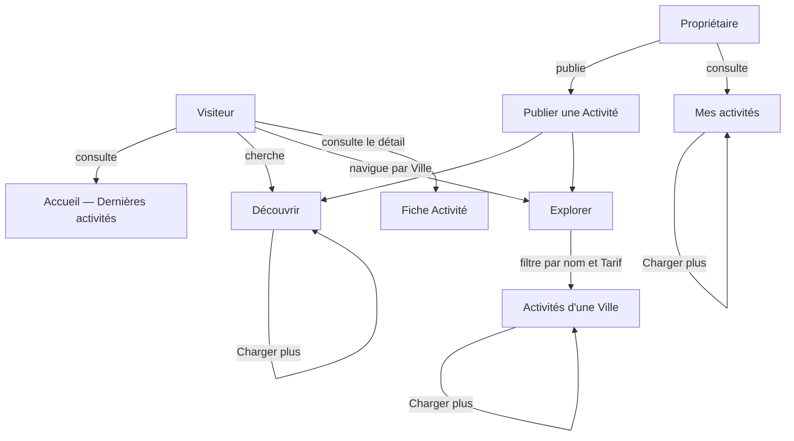

# Catalogue

> Snapshot du 2026-04-29 — régénérer si > 3 mois

> Ensemble des fonctionnalités permettant à un Propriétaire de publier une Activité et à n'importe quel Visiteur ou Utilisateur de la découvrir, l'explorer par Ville et la consulter, avec un mécanisme de pagination par Curseur sur les listes longues.

## Vue d'ensemble

## Fonctionnalités

> Exhaustif : toutes les fonctionnalités du Catalogue figurent dans ce tableau.

| Feature | Acteur | Résultat | Surface | Notes |
|---------|--------|----------|---------|-------|
| Voir les Dernières activités à l'accueil | Visiteur | Aperçu des trois Activités les plus récemment publiées sur la page d'accueil. | both | Vitrine d'entrée du produit. Taille fixe à trois — pas de Curseur, pas de Charger plus. |
| Découvrir les Activités | Visiteur | Première Page d'activités triées de la plus récente à la plus ancienne. | both | Si l'Utilisateur est connecté, un raccourci de Publication apparaît. |
| Explorer les Villes | Visiteur | Liste des Villes dans lesquelles au moins une Activité est publiée. | both | Construite à partir des Villes distinctes du Catalogue. |
| Consulter les Activités d'une Ville | Visiteur | Première Page d'activités proposées dans la Ville sélectionnée. | both | Point d'entrée du filtrage par nom et par Tarif. |
| Filtrer les Activités d'une Ville par nom | Visiteur | Page d'activités restreinte à celles dont le nom correspond au texte saisi. | both | Recherche temporisée côté client, insensible à la casse et aux accents côté serveur. État conservé dans l'URL. |
| Filtrer les Activités d'une Ville par Tarif | Visiteur | Page d'activités restreinte à celles dont le Tarif journalier ne dépasse pas le plafond saisi. | both | Combinable avec le filtre par nom. État conservé dans l'URL. |
| Charger plus d'Activités | Visiteur | Page d'activités suivante ajoutée à la liste affichée, à partir du Curseur courant. | both | Disponible sur Découvrir, Activités d'une Ville et Mes activités. Bouton masqué quand le Curseur est absent (liste terminée). |
| Consulter la fiche d'une Activité | Visiteur | Vue détaillée d'une Activité : nom, description, Ville, Tarif journalier, Propriétaire. | both | Accessible depuis n'importe quelle liste. |
| Publier une Activité | Propriétaire | Une nouvelle Activité visible immédiatement dans le Catalogue, rattachée au Propriétaire connecté. | both | Exige une Session ouverte. La Ville est saisie via une recherche assistée sur le référentiel des communes françaises. Le Tarif journalier doit être strictement positif. |
| Consulter Mes activités | Propriétaire | Première Page d'activités publiées par le Propriétaire connecté. | both | Exige une Session ouverte. |

## Dépendances externes

- **Référentiel des communes françaises (geo.api.gouv.fr)** : utilisé à la saisie d'une Ville lors de la Publication d'une Activité, pour proposer une autocomplétion temporisée.
