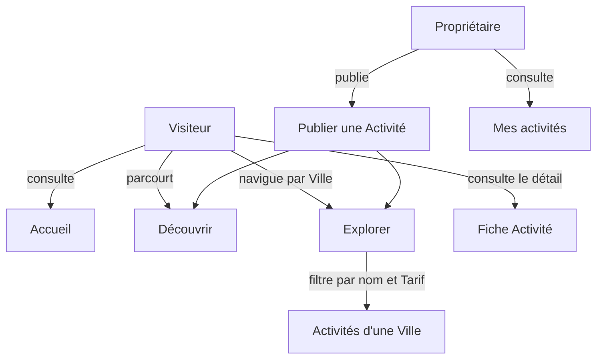

# Catalogue

> Snapshot du 2026-04-28 — régénérer si > 3 mois

> Ensemble des fonctionnalités permettant à un Propriétaire de publier une Activité et à n'importe quel Visiteur ou Utilisateur de la découvrir, l'explorer par Ville et la consulter.

## Vue d'ensemble

## Fonctionnalités

> Exhaustif : toutes les fonctionnalités du Catalogue figurent dans ce tableau.

| Feature | Acteur | Résultat | Surface | Notes |
|---------|--------|----------|---------|-------|
| Voir les dernières Activités à l'accueil | Visiteur | Aperçu des 3 Activités les plus récemment publiées sur la page d'accueil. | both | Vitrine d'entrée du produit. |
| Découvrir toutes les Activités | Visiteur | Liste complète des Activités triées de la plus récente à la plus ancienne. | both | Page `/discover`. Si l'Utilisateur est connecté, un raccourci de publication apparaît. |
| Explorer les Villes | Visiteur | Liste des Villes dans lesquelles au moins une Activité est publiée. | both | Construite à partir des Villes distinctes du Catalogue. |
| Consulter les Activités d'une Ville | Visiteur | Liste des Activités proposées dans la Ville sélectionnée. | both | Point d'entrée du filtrage. |
| Filtrer les Activités d'une Ville par nom | Visiteur | Liste restreinte aux Activités dont le nom correspond au texte saisi. | front | Recherche temporisée pour limiter les requêtes. État conservé dans l'URL. |
| Filtrer les Activités d'une Ville par Tarif | Visiteur | Liste restreinte aux Activités dont le Tarif journalier ne dépasse pas le plafond saisi. | both | Combinable avec le filtre par nom. État conservé dans l'URL. |
| Consulter la fiche d'une Activité | Visiteur | Vue détaillée d'une Activité : nom, description, Ville, Tarif journalier, Propriétaire. | both | Accessible depuis n'importe quelle liste. |
| Publier une Activité | Propriétaire | Une nouvelle Activité visible immédiatement dans le Catalogue, rattachée au Propriétaire connecté. | both | Exige une session ouverte. La Ville est saisie via une recherche assistée sur le référentiel des communes françaises. Le Tarif journalier doit être strictement positif. |
| Consulter Mes activités | Propriétaire | Liste de toutes les Activités publiées par le Propriétaire connecté. | both | Page `/my-activities`. Exige une session ouverte. |

## Dépendances externes

- **Référentiel des communes françaises (geo.api.gouv.fr)** : utilisé à la saisie d'une Ville lors de la Publication d'une Activité, pour proposer une autocomplétion temporisée.
