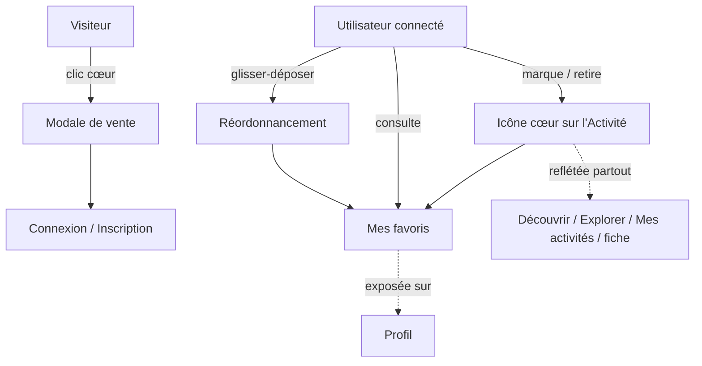

# Favoris

> Snapshot du 2026-04-30 — régénérer si > 3 mois

> Marquage personnel, réversible et ordonné d'Activités par un Utilisateur connecté, consulté depuis son Profil. La relation n'affecte ni la visibilité ni le classement des Activités pour les autres Utilisateurs.

## Vue d'ensemble

## Fonctionnalités

> Exhaustif : toutes les fonctionnalités du domaine Favoris figurent dans ce tableau.

| Feature | Acteur | Résultat | Surface | Notes |
|---------|--------|----------|---------|-------|
| Marquer une Activité comme Favori | Utilisateur connecté | L'Activité est insérée en tête de Mes favoris ; l'icône cœur reflète l'état partout où l'Activité apparaît (Découvrir, Explorer, Mes activités, fiche). | both | Insertion en position 0, les autres Favoris décalés. Échec explicite si le Plafond de favoris est atteint. |
| Retirer un Favori | Utilisateur connecté | L'Activité est retirée de Mes favoris ; les positions restantes sont compactées sans trou. | both | Idempotent : retirer une Activité absente est silencieux. |
| Consulter Mes favoris | Utilisateur connecté | Liste finie ordonnée des Favoris affichée sur le Profil, avec les Activités hydratées (nom, Ville, Tarif journalier, Propriétaire). | both | Pas de Curseur, pas de Charger plus — taille bornée par le Plafond de favoris. Hydratée en SSR sur `/profil`. |
| Réordonner Mes favoris | Utilisateur connecté | Le nouvel ordre est persisté côté serveur et visible au reload. | both | Glisser-déposer avec poignée explicite, mise à jour optimistic et rollback en cas d'erreur. Réécriture complète de la séquence côté serveur. |
| Inviter un Visiteur à se connecter quand il marque un Favori | Visiteur | Une Modale de vente explique la feature et propose Connexion ou Inscription, sans quitter la page courante. | front | Préserve le contexte de navigation (scroll, filtres en cours). |
| Refuser au-delà du Plafond de favoris | Utilisateur connecté | Toast d'erreur explicite « Vous avez atteint la limite de 100 favoris. » Le cœur reste vide, l'Activité n'est pas ajoutée. | both | Plafond dur de 100 Favoris par Utilisateur, appliqué côté serveur. |

## Dépendances inter-contextes

- **Catalogue** : un Favori référence une Activité par identifiant uniquement ; le domaine Catalogue reste agnostique des Favoris (aucun couplage côté serveur).
- **Identité** : toute mutation (marquage, retrait, réordonnancement) exige une Session ouverte. Mes favoris est exposée sur le Profil sans en faire partie : c'est une projection séparée, hydratée en SSR sur `/profil`.
- **Hydratation front-only** : un set d'identifiants de Favoris est préchargé à la Connexion et conservé côté client pour refléter instantanément l'état du cœur partout où une Activité apparaît, sans requête supplémentaire. Couplage assumé entre Catalogue et Identité côté front, jamais côté serveur.

## Notes

- Le Propriétaire d'une Activité peut la marquer en Favori (choix par défaut).
- Pas de cascade en cas de suppression d'une Activité : le point reste théorique tant qu'aucune feature de suppression d'Activité n'existe dans le Catalogue.
