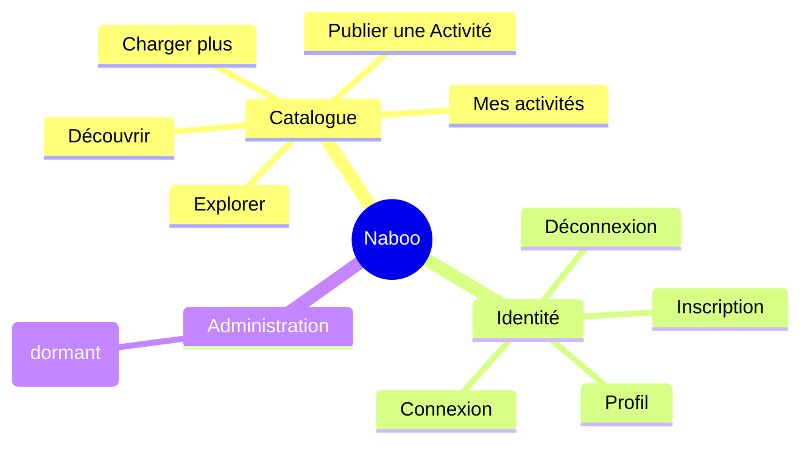

# Feature Map — Naboo Case Study

> Snapshot du 2026-04-29 — régénérer si > 3 mois

> Plateforme permettant aux Utilisateurs de publier et de découvrir des Activités proposées dans différentes Villes, avec un Tarif journalier.

## Domaines

## Périmètre

| Domaine | Description | Sous-document |
|---------|-------------|---------------|
| Catalogue | Création, consultation, recherche et pagination des Activités proposées par les Propriétaires. | [FEATURES.CATALOGUE.md](FEATURES.CATALOGUE.md) |
| Identité | Cycle de vie du compte Utilisateur : Inscription, Connexion, Déconnexion, consultation du Profil. | [FEATURES.IDENTITE.md](FEATURES.IDENTITE.md) |
| Administration | Modèle de Rôle (Utilisateur standard / Administrateur) — déclaré en base mais sans feature exposée à date. | [FEATURES.ADMINISTRATION.md](FEATURES.ADMINISTRATION.md) |

## Relations entre domaines

- **Catalogue → Identité** : toute Activité a un Propriétaire, qui est un Utilisateur en Session. Publier une Activité et consulter Mes activités exigent une Session ouverte.
- **Administration → Identité** : le Rôle est un attribut de l'Utilisateur. Aucune feature ne consomme encore cette frontière côté produit.

## Zones non cartographiées

> Résidus identifiés dans la codebase qui ne constituent pas des features livrées. Mentionnés ici pour qu'un dev qui reprend le projet sache qu'ils existent et qu'ils sont **incomplets / à faire**.

| Élément | Surface | Statut | Pointeur |
|---------|---------|--------|----------|
| Activités favorites | both | Roadmap — à faire plus tard. Permettre à un Utilisateur de marquer / retrouver ses Activités favorites. Aucune trace dans le code à date. | — |
| Mode debug Utilisateur | back | Roadmap — à faire plus tard. Activer un mode de diagnostic pour un Utilisateur. Aucune trace dans le code à date. | — |
| Modification / suppression d'Activité | both | À implémenter — un Propriétaire ne peut aujourd'hui ni éditer ni retirer une Activité après publication. | `src/pages/api/activities/[id].ts` (GET seul), aucun service `update` / `delete` côté `src/server/activities/activity.service.ts` |
| Sonde de santé `/api/health` | back | À rattacher — endpoint technique non relié à un usage produit (sonde infra possible). | `src/pages/api/health.ts` |
| Limitation de débit (rate limiting) | back | Infra transverse — protection technique appliquée sur les routes API, sans surface produit. | `src/server/rate-limit.ts` |
| Jeu de démo seedé au démarrage | back | Infra dev — peuple un Utilisateur standard, un Administrateur et plusieurs Activités au démarrage. Non considéré comme feature métier. | `src/server/seed/` |

Pistes de résolution suggérées :
- [ ] Cadrer le périmètre **Activités favorites** (Profil ou Catalogue ?) avant de l'ouvrir.
- [ ] Cadrer le périmètre **Administration** (Rôle dormant + outils de debug) avant d'exposer une UI.
- [ ] Spécifier le cycle de vie d'une **Activité** (édition, retrait) côté Catalogue.
- [ ] Documenter à quoi sert la sonde `/api/health` (intégration monitoring ?).
