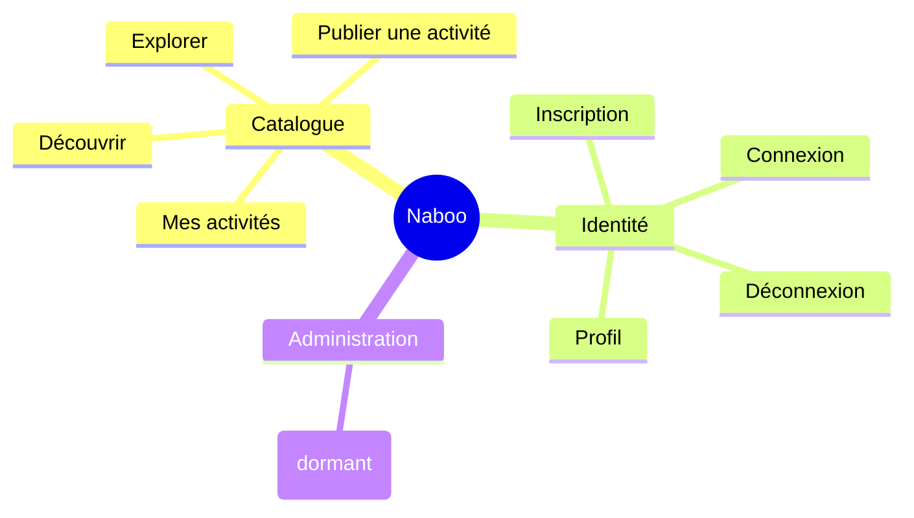

# Feature Map — Naboo Case Study

> Snapshot du 2026-04-28 — régénérer si > 3 mois

> Plateforme permettant aux Utilisateurs de publier et de découvrir des Activités proposées dans différentes Villes, avec un Tarif journalier.

## Domaines

## Périmètre

| Domaine | Description | Sous-document |
|---------|-------------|---------------|
| Catalogue | Création, consultation et recherche des Activités proposées par les Propriétaires. | [FEATURES.CATALOGUE.md](FEATURES.CATALOGUE.md) |
| Identité | Cycle de vie du compte Utilisateur : inscription, connexion, déconnexion, consultation du Profil. | [FEATURES.IDENTITE.md](FEATURES.IDENTITE.md) |
| Administration | Modèle de Rôle (utilisateur / administrateur) — déclaré en base mais sans feature exposée à date. | [FEATURES.ADMINISTRATION.md](FEATURES.ADMINISTRATION.md) |

## Relations entre domaines

- **Catalogue → Identité** : toute Activité a un Propriétaire, qui est un Utilisateur authentifié. Publier une Activité et consulter Mes activités exigent une session ouverte.
- **Administration → Identité** : le Rôle est un attribut de l'Utilisateur. Aucune feature ne consomme encore cette frontière côté produit.

## Zones non cartographiées

> Résidus identifiés dans la codebase qui ne constituent pas des features livrées. Mentionnés ici pour qu'un dev qui reprend le projet sache qu'ils existent et qu'ils sont **incomplets / à faire**.

| Élément | Surface | Statut | Pointeur |
|---------|---------|--------|----------|
| Activités favorites | front | À implémenter — type `favoriteActivities` présent côté Profil mais jamais peuplé, aucune mutation ni stockage côté back. | `front-end/src/pages/profil.tsx` |
| Mode debug Utilisateur | back | À implémenter — méthode de service présente sans mutation GraphQL ni interface d'appel. | `back-end/src/user/user.service.ts` (`setDebugMode`) |
| Endpoint REST `health-check` | back | À rattacher — endpoint technique non relié à un usage produit (sonde infra possible). | `back-end/src/app.controller.ts` |
| Modification / suppression d'Activité | both | À implémenter — un Propriétaire ne peut aujourd'hui ni éditer ni retirer une Activité après publication. | aucune mutation `updateActivity` / `deleteActivity` côté back |
| Jeu de démo seedé au démarrage | back | Infra dev — peuple un Utilisateur, un Administrateur et plusieurs Activités à chaque boot. Non considéré comme feature métier. | `back-end/src/seed/` |

Pistes de résolution suggérées :
- [ ] Décider si les Activités favorites entrent dans le périmètre v1 du Profil (Identité) ou du Catalogue.
- [ ] Cadrer le périmètre Administration (rôle dormant + mode debug) avant d'exposer une UI.
- [ ] Spécifier le cycle de vie d'une Activité (édition, retrait) côté Catalogue.
